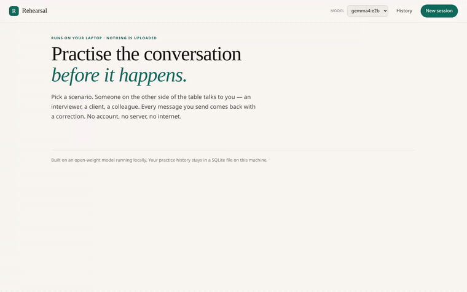
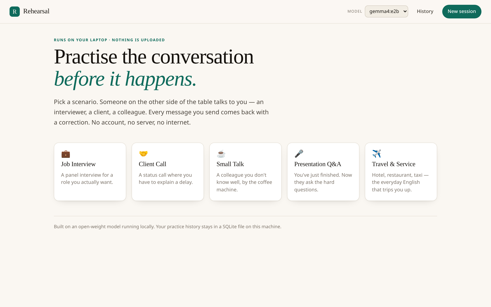
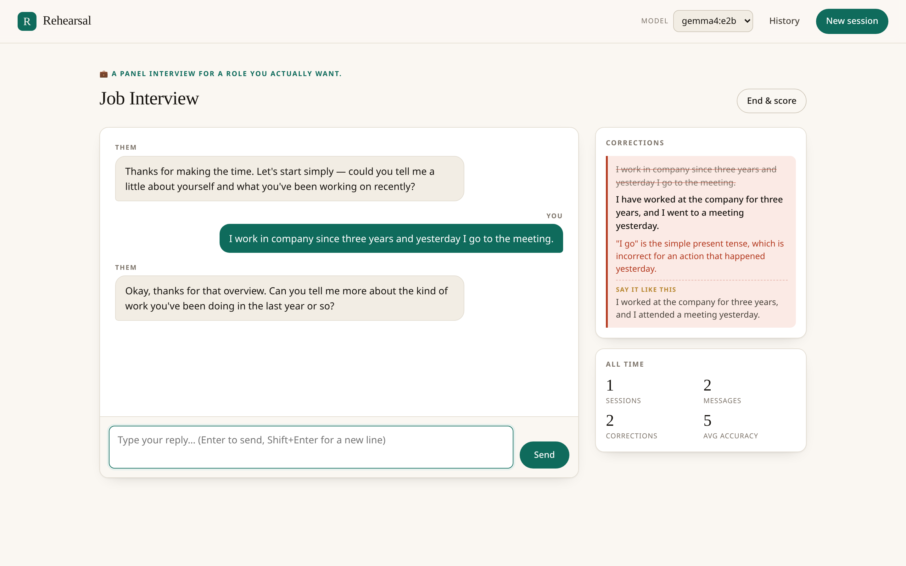
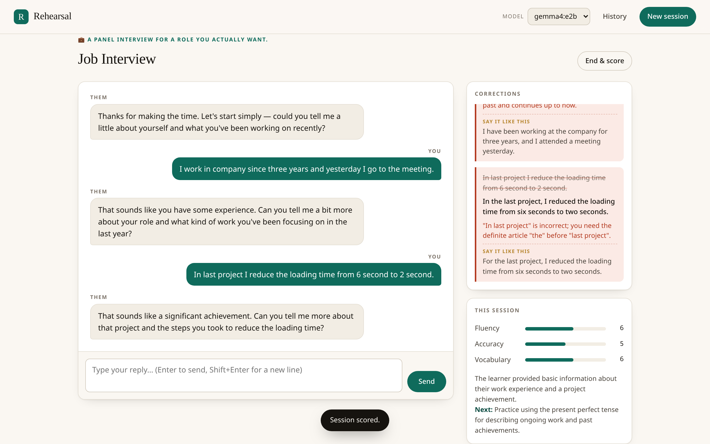

# Rehearsal

**Practise the conversation before it happens.**

An offline English conversation partner. It plays the other person — an
interviewer, a client, a colleague you barely know — comes back in character,
and corrects every message you send. It runs entirely on your own laptop
against an open-weight model. No account, no API key, no internet, no telemetry.

> Built for Hacktoberfest 2026 · DEV Weekend Challenge: **Build for a Friend**

<!-- PERSONALISE: name the friend and their concrete problem here, in one or
     two sentences. This is the single most heavily weighted judging criterion
     ("Relevance to the Prompt and Theme"), so be specific rather than warm.
     Example shape: "This is for Rohit, who freezes in English interviews
     despite being able to reason about distributed systems in Hindi. He had
     three interviews in two weeks and no safe place to practise out loud." -->

## Why this exists

English fluency is not the same as being able to think. Plenty of people can
design a system, lead a team or argue a point perfectly well in their first
language and then go blank when the same conversation has to happen in English.
The gap is almost never grammar knowledge — it is **reps**. Timed, repeated,
low-stakes reps of the actual conversation you are about to have.

The obvious fix is a tutor. Tutors cost money, need scheduling, and — this is
the part that matters — they put your voice, your half-formed sentences and
your job-search anxiety on somebody else's servers.

Rehearsal removes the money, the scheduling and the server. What's left is the
part that was always the point: reps.

## What it does

- **Plays a role, not a chatbot.** Five scenarios ship with the app — job
  interview, client call, small talk, presentation Q&A, travel & service. The
  model stays in character, probes with follow-up questions, and never breaks
  the fourth wall to lecture you.
- **Corrects every message you send.** Each of your turns produces a card with
  your original, a native-speaker rewrite, one sentence naming the actual
  error, and a more idiomatic alternative.
- **Scores the session.** End a session and the model returns a fluency /
  accuracy / vocabulary scorecard plus one specific thing to practise next
  time. Averages accumulate across sessions so progress is visible.
- **Swaps models from the UI.** The dropdown lists whatever is installed in
  Ollama. Change the model, keep everything else — the prompts, the history,
  the scorecard. No code edits, no redeploy.
- **Streams.** The partner's reply arrives token by token over SSE while the
  correction runs concurrently, so a turn costs one round trip rather than two.

## Why open innovation is the whole point

Every one of these is a thing a closed API makes impossible or awkward:

| | With a closed API | With Rehearsal |
|---|---|---|
| **Works offline** | No. The app is a network client with extra steps. | Yes. Pull the model once; afterwards the laptop goes on a plane and it still works. |
| **Your sentences stay yours** | Every practice turn is a request to a third party, logged on their terms. | The transcript lives in one local SQLite file. `data/` is gitignored. There is no outbound call to make. |
| **Swap the model** | You're on their model roadmap, not yours. | One dropdown. Try a bigger model on a desktop, a smaller one on a laptop, same app. |
| **Cost** | Per-token, forever, and the bill scales with how much you practise — which is exactly the behaviour you want to encourage. | One 4.6 GB download. Then practising is free, so practising more is free. |
| **Change how the agent behaves** | Prompt-only, and only within what their system prompt permits. | The three prompts are plain Python strings in `app/prompts.py`. Edit, restart, done. |

The last row is the one that mattered most while building this. The whole
product is a set of instructions to a small model, and the difference between a
useful coach and an annoying one was prompt engineering and output parsing —
not model capability. That is only practical to iterate on when the model, its
weights and the harness are all something you can read, edit and re-run.

### Where open beat closed in practice

**A 4.6 GB download was enough.** Rehearsal's core loop is deliberately narrow:
stay in character for 1–3 sentences, and rewrite one message in three labelled
lines. Gemma 4 E2B does both in a couple of seconds — **5.8 s cold load, 3.0 GB
resident in a 4 GB GPU, 30–55 tok/s** as measured on a GTX 1650 Ti. A frontier
model would do it slightly better, at the cost of money per attempt, a network
dependency, and sending every practice sentence off-device. The closed option
would have been solving a problem this app doesn't have.

**The failure modes were ours to fix.** Gemma 4 ships with a hidden "thinking"
pass switched on by default. On a 4 GB card it consumed the entire token budget
before a single visible word appeared, which reads to the user as a hang — the
first time I called it, the request timed out at 120 seconds with nothing
written. `llm.py` now sends `think: false` explicitly: a one-line fix you can
only make because you own the inference stack. The same is true of formatting —
a small model bolds labels, drops colons, or rambles instead of answering, and
every one of those is a parsing bug with a regex and a fallback as its cure.
`tests/test_coach.py` is a catalogue of those failures; they're tested because
they happened.

## Demo

**31 seconds, one continuous take, no edits** — recorded locally while it ran:

[](docs/rehearsal-demo.mp4)

The GIF above is a preview — click it for [the full-resolution MP4](docs/rehearsal-demo.mp4)
(1.1 MB, 1440×900). *GitHub strips `<video>` tags from READMEs, so the GIF is
what renders inline.*

It does the whole loop: pick a scenario → send a deliberately broken sentence →
stream an in-character reply → get a correction that names the actual rule →
end the session → get a scorecard.



A single message produces this — the original, a native rewrite, one sentence
naming the rule, and a more idiomatic alternative:



End the session and the model scores it, with averages across every session
you have ever run:



## How it's built

```
rehearsal/
├── app/
│   ├── main.py       FastAPI routes + the SSE turn loop
│   ├── llm.py        async Ollama client — the only place the model is touched
│   ├── coach.py      prompt assembly + defensive output parsing
│   ├── prompts.py    the three system prompts (edit these to change behaviour)
│   ├── scenarios.py  role definitions and scripted openings
│   └── store.py      SQLite persistence (sessions, messages, corrections)
├── static/           vanilla HTML/CSS/JS — no build step, no framework, no CDN
└── tests/            45 tests: parser edge cases, persistence, HTTP contract,
                       and the offline guarantee
```

**Open-source AI at the core:**

- **Model:** [`gemma4:e2b`](https://ollama.com/library/gemma4:e2b) — Google
  DeepMind's **Gemma 4 Effective-2B** (2.3B effective / 5.1B total parameters,
  128K context) in Q4_K_M, running locally under **Apache 2.0**. It loads in
  ~6 s and sits in **3.0 GB of a 4 GB** GPU.
- **Runtime:** [Ollama](https://ollama.com) (MIT) serving over
  `http://127.0.0.1:11434`.
- **Harness:** written from scratch for this project — FastAPI, httpx,
  SQLite, vanilla JS. No agent framework, so there is nothing between you and
  the three prompts.

**One turn looks like this:**

```
learner message ──┬──► /api/chat   (streamed, in character)  ──► SSE "reply"
                  │      asyncio.gather — concurrent, one round trip
                  └──► /api/generate (three labelled lines)   ──► SSE "correction"
```

Both calls only depend on the learner's message and the transcript, so they run
concurrently. Latency is `max(reply, correction)` rather than the sum.

## Quick start

Requires [Ollama](https://ollama.com/download) and Python 3.10+.

```bash
# 1. one-time: pull the model (~4.6 GB)
ollama pull gemma4:e2b

# 2. start the local server
ollama serve &

# 3. start Rehearsal
./run.sh
# → http://127.0.0.1:8000
```

`run.sh` creates the virtualenv on first run and warns you if Ollama isn't up.

### Swapping the model

Pick a different one from the dropdown in the header, or set it before starting:

```bash
OLLAMA_MODEL=qwen2.5:3b ./run.sh
```

Anything with a chat endpoint works — `llama3.2:3b`, `phi3.5`, `mistral`,
`qwen2.5:7b`. Bigger models write better corrections and need more VRAM; the
scorecard prompt is the only place model quality really shows.

## Tests

```bash
.venv/bin/python -m pytest
# 45 passed
```

`tests/test_offline.py` is the one worth a look: **"there is no outbound call
to make" is a test, not a claim.** It fails the build if an absolute URL
anywhere other than loopback appears in the source, if the frontend makes a
cross-origin `fetch`, if `index.html` references a remote asset, or if the test
suite ever opens a real transcript instead of a throwaway file.

`tests/test_coach.py` is the interesting one: it documents the ways a small
model refuses to follow instructions, and asserts the app degrades gracefully
instead of throwing.

**`tools/eval_why.py`** is the companion *measurement* rather than a test — it
talks to the real model, so it isn't in the suite. It fires the correction call
at five typical learner errors and checks that the `WHY` line is actually about
the sentence in front of it. The failure it exists to catch is a model
confidently diagnosing an error that isn't there — an early run told someone
*since* was wrong in a message that never used *since*. Run it after every
prompt change:

```bash
.venv/bin/python tools/eval_why.py
# grounded 5/5
```

## Privacy

- The transcript lives in `data/rehearsal.db` — a single local file.
- `data/` is in `.gitignore`, so it cannot be pushed by accident.
- No analytics, no phone-home, no authentication, no cloud dependency.
- Rehearsal makes exactly one kind of network call: to Ollama, by default on
  `127.0.0.1`. Point `OLLAMA_HOST` somewhere else and you've changed that.

## Notes and limits

- Text-only by design — voice mode was cut to protect the deadline.
- Scores come from a small local model. Treat them as a directional nudge, not a
  placement test.
- Single user, single machine. There is no auth layer because there is no
  multi-user layer.

## License

[MIT](LICENSE)
